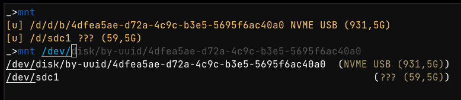
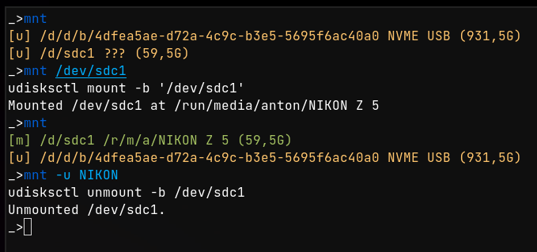

# mnt - A mount/unmount utility for the fish shell

`mnt` wants to be the fastest way to mount/unmount external media from the command line. You can configure custom mount commands, it has autocompletion and some user-friendly matching logic.

## Install

Run the `install.fish` script to install `mnt.fish` into your fish functions (and completions). It install all dependencies as well, which are the `coalesce` and `shorten_path` fish functions, they are:

 * `coalesce ARGS...` prints the first non-empty argument. 
 * `shorten_path /path/to/somewhere` shortens all path segments except the last one to be one character, smilar to fishs prompt.

The install script expects your fish config folder to reside in `~/.config/fish/`. If it cant find `~/.config/fish/config.fish` it will abort the installation. You can either pass the path to your fish config to the install script, or install it manually. The install script symlinks the files from this repo into your fish config folder, which allows for easy updating using `git pull` in this repo. If you don't want that, you can specify the `--copy` flag to the install script to copy the files instead.

### External Dependencies

This script uses `ripgrep`, `blkid`, `jq` and `udisksctl`. Make sure they are installed on your system, or you'll get weird errors!

### Extra Scripts

This repo also contains two more scripts, one named `mount-luks` and one called `mount-vc`. They:

 - `mount-luks DEVICE PASS_KEY MAPPER_NAME` mount a luks-encrypted volume using a password from the pass password manager (unmount using `mount-luks -u MAPPER_NAME`)
 - mount a veracrypt volume using either a keyfile, or a password. Note that since the password is passed as an argument to the veracrypt process, it can be observed by other processes until the veracrypt process terminates (I am not exactly sure how long that is though, probably only until it finished mounting, but it could be longer.)

You can copy and modify these scripts as needed.

## Usage

Run `mnt` to get a status listing for all mounts (Same as `mnt -l`). Example output:

```
> mnt
[-] /d/d/b/4dfea5ae-d72a-4c9c-b3e5-5695f6ac40a0	NVME USB
[m] /d/s/r/m/a/writable (54,8G)
[u] /d/sdc1	??? (3,1G)
[u] /d/sdc2	??? (3,9M)
```

The status of each mount is indicated by the color and symbol in front:

 - `[-]` (red) - This volume is currently unavailable, it cannot be mounted
 - `[u]` (yellow) - This volume is unmounted, you can mount it
 - `[m]` (green) - This volume is mounted, you can unmount it

It also prints the device, the devices label, if available (otherwise `???`) and the devices size (if it can be determined).

You can mount a volume by simply specifying `mnt IDENTIFIER`, it will autocomplete available block devices for you, but you can also specify (parts of) labels or size, basically anything that identifies the volume uniquely. (The volume is selected by grepping for `IDENTIFIER` in the output of `mnt_core_list_mounts`)



Unmounting is just as easy, you can run `mnt -u IDENTIFIER`, with the same rules for the identifier. The autocompletion will only offer you already mounted devices.



### Configuration

The script mounts block devices using `udisksctl` by default. If you have a more involved setup, you can edit the `.mounts` file in your home directory. The format is roughly documented in the file, but I'll go into more detail here:

The file contains five columns, separated by tabs (real tab characters). Empty lines, or lines starting with a `#` are skipped.

The columns are:

 - block device
 - path where it would mount to
 - command to mount (can be a fish function, can use arguments, just be careful with tab characters. You currently cannot escape them in the config file). the variables `$device` and `$path` can be used here, they will be replaced with the block device, and mount path respectively.
 - command to unmount (see above)
 - display name

You can use the `mount-vc` and `mount-luks` scripts here for ease of use. e.g.

```
> cat .mounts
# my luks-encrypted USB
/dev/disk/by-uuid/<uuid>	/run/media/<user>/<id>	mount-luks $device devices/my_luks_usb luks_usb	mount-luks -u luks_usb	My Luks USB
# my veracrypt HDD using a key in ~/.keys
/dev/disk/by-uuid/<uuid>	/run/media/<user>/<id>	mount-vc $device my-hdd-key $path	mount-vc -u $path	Veracrypt HDD
```

You can then mount/unmount these using `mnt Luks` or `mnt HDD` (because of the way the `IDENTIFIER` is resolved to an entry in the volume table).

## TODO:

This script currently ignores /dev/sda and /dev/nvme0n1 and all their partitions. This is non-configurable at the moment, the only way to change this behaviour is to edit the `functions/mnt.fish` file and change the `set _MNT_SEEN_DEVICES` line.

You can add ignroed devices using the `MNT_IGNORE_DEVICES` environment variable. We might be able to phase out the `_MNT_SEEN_DEVICES` variable in favour of this. On the other hand, it's questionable if we want to pollute the environment with some info that might be better suited to a config file. But if we have *two* config files, we should probably move them into a `.config/mnt/` folder or something. That's why I haven't done this refactor yet.

## License

These scripts are licensed under the MIT license
